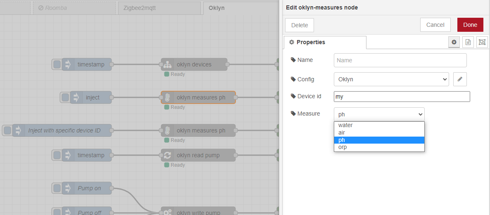

# node-red-oklyn
This set of node-red nodes communicate with oklyn cloud API, if you like my work you can leave me a message, star github repo and/or buy me a coffee it's always pleasant

# Install
Either use the Manage Palette option in the Node-RED Editor menu, or run the following command in your Node-RED user directory - typically '~/.node-red'

    npm i @abstract-entity/node-red-oklyn

# Flow example
Link below show you an implementation of each oklyn node with manual trigger

## [Flow example](examples/example.json)
 

# API Usage
## Configuration
To find your api key follow this steps:
1.  Open your Oklyn mobile app, and go to 'my account'
2.  Open 'API Access' at the bottom of page
3.  Activate API access
4.  Copy your API key

To add your api key in node-red configuration:
1. Drag any oklyn node in your flow panel
2. Double click the node
3. For the 'Config' property select 'Add new oklyn-config', then click the 'edit pen'
4. Paste your API key in 'Api key' peroperty, then click add

## List devices
**Configuration**
- Name (optionnal): Name to display for the node
- Config (required): Oklyn api key to use for the call

**Payload Input**
- No particular payload required

**Payload output**
- output

      [
        {"id":228,"username":"first swimming pool"},
        {"id":229,"username":"Secondary home swimming pool"},
        {"id":230,"username":"Third swimming pool"}
      ]

## Read measures
**Configuration**
- Name (optionnal): Name to display for the node
- Config (required): Oklyn api key to use for the call
- Device id (required): Id of the device, if you manage multiple device you can specify the id of device to connect to. if you got only one device use 'my' to select it without knowing id
- Measure (required): Name of the measure to read, can be: air, water, ph, or orp

**Payload Input**
- No particular payload input expected.
- You can override device id of the node, by adding it to **msg.deviceId** (outside of the payload)

      { 
        "deviceId": 228
      }

    

**Payload output**
- output

      {
        "recorded": "2022-03-06T13:45:04+00:00",
        "value": 8.61,
        "status": "danger",
        "value_raw": 8.61
      }

## Read pump state
**Configuration**
- Name (optionnal): Name to display for the node
- Config (required): Oklyn api key to use for the call
- Device id (required): Id of the device, if you manage multiple device you can specify the id of device to connect to. if you got only one device use 'my' to select it without knowing id

**Payload Input**
- No particular payload input expected.
- You can override device id of the node, by adding it to **msg.deviceId** (outside of the payload)

      { 
        "deviceId": 228
      }

**Payload output**
- output

      {
        "pump": "auto",
        "status": "off",
        "changed_at": "2022-03-07T05:00:01+00:00"
      }

## Write pump state
**Configuration**
- Name (optionnal): Name to display for the node
- Config (required): Oklyn api key to use for the call
- Device id (required): Id of the device, if you manage multiple device you can specify the id of device to connect to. if you got only one device use 'my' to select it without knowing id

**Payload Input**
- You can change the state of the pump by following values: on, off, auto

      {
          "pump": "auto"
      }

- You can override device id of the node, by adding it to **msg.deviceId** (outside of the payload)

      { 
        "deviceId": 228
      }

**Payload output**
- output

      {
        "pump": "auto",
        "status": "off",
        "changed_at": "2022-03-07T05:00:01+00:00"
      }

## Read auxiliary contact state
**Configuration**
- Name (optionnal): Name to display for the node
- Config (required): Oklyn api key to use for the call
- Device id (required): Id of the device, if you manage multiple device you can specify the id of device to connect to. if you got only one device use 'my' to select it without knowing id

**Payload Input**
- You can override device id of the node, by adding it to **msg.deviceId** (outside of the payload)

      { 
        "deviceId": 228
      }

**Payload output**
- output

      {
        "aux": "off",
        "status": "off",
        "changed_at": "2022-03-07T08:49:40+00:00"
      }

## Write auxiliary contact state
**Configuration**
- Name (optionnal): Name to display for the node
- Config (required): Oklyn api key to use for the call
- Device id (required): Id of the device, if you manage multiple device you can specify the id of device to connect to. if you got only one device use 'my' to select it without knowing id
  
**Payload Input**
- You can change the state of the auxiliary contact by following values: on, off

      {
        "aux": "off"
      } 

 - You can override device id of the node, by adding it to **msg.deviceId** (outside of the payload) 
 
      { 
        "deviceId": 228
      }

**Payload output**
- output

      {
        "aux": "off",
        "status": "off",
        "changed_at": "2022-03-07T08:49:40+00:00"
      }